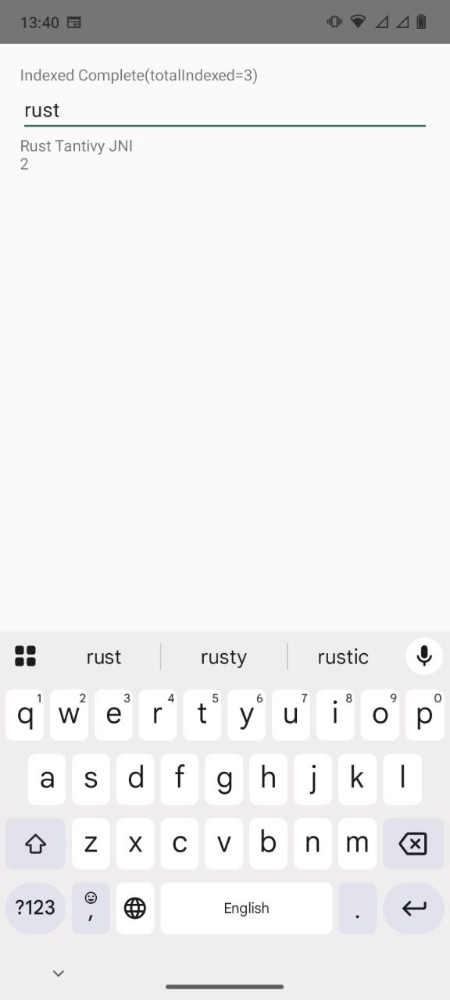

# Tantivy JNI

[](https://github.com/RustedBytes/tantivy-jni/actions/workflows/rust.yml)
[](https://github.com/RustedBytes/tantivy-jni/actions/workflows/android.yml)
[](https://github.com/RustedBytes/tantivy-jni/actions/workflows/ios.yml)

Kotlin (Android) and Swift (iOS/macOS) bindings for [Tantivy](https://github.com/quickwit-oss/tantivy), backed by the same Rust core.

On Android the core is reached through JNI; on Apple platforms it is reached through a C ABI and packaged as an XCFramework. Both bindings expose a typed API with builder DSLs and share the same JSON wire contract, so behavior is consistent across platforms.

- **Android / Kotlin** — coroutine-friendly indexing and search. Native calls are synchronous and blocking internally; Kotlin dispatches them through caller-configurable coroutine dispatchers. See [docs/API.md](docs/API.md).
- **iOS / macOS / Swift** — the `TantivyKit` Swift package with `async`/`await` (and synchronous) index and search operations. See [docs/IOS.md](docs/IOS.md).

## Demo in sample-app



## Status

This project is still pre-1.0. The public high-level API is intended to be stable enough for app integration testing, while APIs marked with `@AdvancedTantivyApi` may change before 1.0.

## Requirements

- Android min SDK 23
- Android compile SDK 36
- Rust 1.96.1
- Android NDK 27.2.12479018
- Gradle wrapper from this repository

## Build

Run JVM/Rust checks:

```bash
cargo test
cargo clippy --all-targets -- -D warnings
cargo audit
cargo deny check
./gradlew :tantivy-android:detekt
./gradlew :tantivy-android:dokkaGenerate
./gradlew apiCheck
./gradlew :tantivy-android:testDebugUnitTest
```

Build native Android JNI libraries:

```bash
./install_android_ndk.sh
source .android/ndk.env
scripts/build-android-native.sh
```

Build the Android AAR after native libraries are copied into `tantivy-android/src/main/jniLibs`:

```bash
./gradlew :tantivy-android:assembleRelease
```

The AAR includes consumer R8/ProGuard rules that keep the JNI bridge class name stable for native symbol lookup.

Build the consumer sample app, including release minification:

```bash
./gradlew :sample-app:assembleRelease
```

The sample app lives in `sample-app` and uses the in-repo project dependency for fast development. Use it to smoke test indexing, search flows, packaged JNI libraries, and R8 behavior before cutting a release.

Verify consumption from the repo-local Maven publication:

```bash
scripts/verify-maven-consumer.sh
```

The fixture in `fixtures/maven-consumer` is a separate Gradle build that depends on `com.rustedbytes:tantivy-android` from `tantivy-android/build/repository`, not on the in-repo project dependency.

Publish to the local Maven cache:

```bash
./gradlew :tantivy-android:publishReleasePublicationToMavenLocal
```

Publish to the module-local release repository:

```bash
./gradlew :tantivy-android:publishReleasePublicationToReleaseRepository
```

The local release repository is written to `tantivy-android/build/repository`.

The default coordinates are:

```kotlin
implementation("com.rustedbytes:tantivy-android:0.1.0-SNAPSHOT")
```

For GitHub Packages, add the package repository in the consuming build:

```kotlin
repositories {
    maven {
        url = uri("https://maven.pkg.github.com/rustedbytes/tantivy-jni")
        credentials {
            username = providers.gradleProperty("gpr.user").orNull
            password = providers.gradleProperty("gpr.key").orNull
        }
    }
}
```

Release builds use the pushed tag as the version, stripping a leading `v`. For example, tag `v0.1.0` publishes version `0.1.0`.

`apiCheck` compares the Kotlin public source API against `api/tantivy-android.api`. Run `./gradlew apiDump` intentionally when changing public API.

Before tagging a release, verify the tag version, Cargo version, and changelog entry:

```bash
scripts/verify-release-version.sh 0.1.0
```

## Usage

```kotlin
val schema = TantivyClient.schema {
    string("id")
    text("title", defaultSearch = true)
    i64("publishedAt", fast = true)
}

val index = TantivyClient.open(
    path = File(context.cacheDir, "articles-index").absolutePath,
    schema = schema,
)

index.add(
    TantivyClient.document {
        string("id", "1")
        text("title", "Tantivy on Android")
        i64("publishedAt", System.currentTimeMillis())
    },
)
index.commit()
index.refresh()

val page = index.search(
    TantivyClient.query {
        query = "android"
        selectedFields("id", "title")
        sortBy("publishedAt", SortOrder.Desc)
    },
)
```

See [docs/API.md](docs/API.md) for the full API guide.
See [docs/PRODUCTION.md](docs/PRODUCTION.md) for release gates and production-readiness checks.

## iOS / macOS (Swift)

Build the native XCFramework, then use the `TantivyKit` Swift package in `tantivy-ios`:

```bash
scripts/build-ios-native.sh   # writes tantivy-ios/TantivyFFI.xcframework
cd tantivy-ios && swift test
```

```swift
import TantivyKit

let schema = TantivyClient.schema { s in
    s.string("id")
    s.text("title", defaultSearch: true)
    s.i64("publishedAt", fast: true)
}

let index = try await TantivyClient.open(path: indexDir.path, schema: schema)

try await index.add(TantivyClient.document { d in
    d.string("id", "1")
    d.text("title", "Tantivy on iOS")
    d.i64("publishedAt", Int64(Date().timeIntervalSince1970 * 1000))
})
_ = try await index.commitAndRefresh()

let page = try await index.search(TantivyClient.query { q in
    q.query = "ios"
    q.selectedFields("id", "title")
    q.sortBy("publishedAt", .desc)
})
```

See [docs/IOS.md](docs/IOS.md) for the full Swift guide.

## Release

Pushing a Git tag runs `.github/workflows/release.yml`. The workflow builds JNI libraries for:

- `arm64-v8a`
- `armeabi-v7a`
- `x86`
- `x86_64`

It uploads:

- release AAR
- sample release APK for smoke testing
- Maven repository archive
- GitHub Packages Maven publication
- raw JNI library archive
- per-ABI `.so` files
- cargo and Gradle dependency metadata
- CycloneDX SBOMs for Rust and Gradle dependencies
- release build info
- SHA-256 checksums
- GitHub artifact attestations for release checksums and SBOMs

If `SIGNING_KEY` and `SIGNING_PASSWORD` are configured in the release environment, Maven publication artifacts are signed.

For tag `v0.1.0`, the published Maven version is `0.1.0`.

## Compatibility Policy

Until 1.0, the high-level coroutine API is intended to remain source-compatible across patch releases unless a changelog entry calls out a migration. APIs annotated with `@AdvancedTantivyApi`, native JSON contracts, and release artifact layout may change between minor pre-1.0 versions.

Before promoting a release to production use, verify:

- Rust tests, clippy, audit, and dependency policy pass.
- Android unit tests, Detekt, Android Lint, Dokka, and API compatibility pass.
- Connected Android instrumentation passes on an emulator with packaged JNI libraries.
- `:sample-app:assembleRelease` succeeds with R8 enabled.
- `scripts/verify-maven-consumer.sh` proves the Maven artifact is consumable by a separate Gradle build.
- Release artifacts are checksummed and attested with GitHub artifact attestations.
- The tagged release artifacts can be consumed from a separate Android project.

## License

Licensed under the Apache License, Version 2.0. See [LICENSE](LICENSE).
